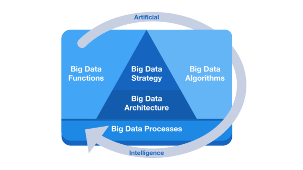
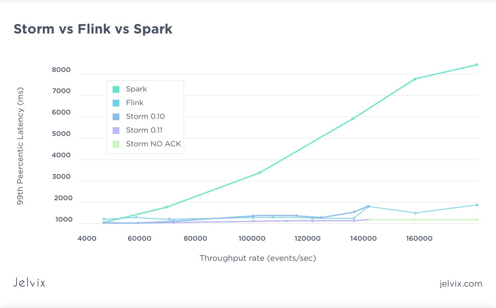

# 數據處理 ( Data Processing )

## 數據管道 ( Data Pipeline )

### 框架概念

A typical data pipeline involves the following steps or processes through which the data passes before being consumed by a downstream process, such as an ML model training process.

+ Data Ingestion: Involves raw data collection from origin and storage using architectures such as batch, streaming or event-driven.
+ Data Transformation: Putting data in a standard format post cleaning and validation steps. It also involves data enriching – a crucial step for further data travel.
+ Data Processing: You need to save the processed data through computations such as aggregation, filtering and sorting.
+ Data Storage: To store this processed data to retrieve it over time – be it a data warehouse or a data lake.
+ Data Consumption: You have reached a point where the data is ready for consumption for AI, BI & other analytics.

Let’s understand how the other aspects of a data pipeline help the organization achieve its various objectives.

+ Automation: A data pipeline automates the process of collecting, processing, and storing large volumes of data. It eliminates the need for manual intervention, reducing the risk of errors and increasing efficiency.
+ Scalability: A data pipeline is designed to handle large volumes of data, making it possible to process and analyze data in real-time, even as the data grows.
+ Data quality: A data pipeline can help improve the quality of data by automating the process of cleaning and transforming the data. This ensures that the data is accurate, consistent, and reliable.
+ Cost-effectiveness: A data pipeline can help reduce the cost of managing and analyzing data by automating repetitive tasks and optimizing resource utilization.
+ Real-time insights: A data pipeline can process and analyze data in real-time, allowing organizations to gain insights and make informed decisions quickly.

## 大數據框架 ( Big Data Framework )

### 框架概念

> from [The Big Data Framework](https://www.bigdataframework.org/an-overview-of-the-big-data-framework/)

大數據框架概念如上圖所示，其框架由六個核心組成

+ Big Data Strategy
+ Big Data Architecture
+ Big Data Algorithms
+ Big Data Processes
+ Big Data Functions
+ Artificial Intelligence

What is data (big data) processing?

It is collecting raw and noisy datasets and converting them into an understandable format. It involves a series of steps — collecting, cleaning, organizing, transforming, and analyzing data to derive valuable insights and, finally, presenting them in a way understandable by laymen.

Businesses leverage the insights derived from datasets to make strategic decisions, resulting in company growth.

Big data frameworks simplify this series of steps in data processing by providing a basic framework that helps them make the most out of big data in less time.

### 主流框架

#### Hadoop

Hadoop is great for reliable, scalable, distributed calculations. However, it can also be exploited as common-purpose file storage. It can store and process petabytes of data. This solution consists of three key components:

+ HDFS file system, responsible for the storage of data in the Hadoop cluster;
+ MapReduce system, intended to process large volumes of data in a cluster;
+ YARN, a core that handles resource management.

Hadoop is great for customer analytics, enterprise projects, and creation of data lakes. Or for any large scale batch processing task that doesn’t require immediacy or an ACID-compliant data storage.

#### Spark

Apache Spark is an open-source framework, created as a more advanced solution, compared to Apache Hadoop. The initial framework was explicitly built for working with Big Data. The main difference between these two solutions is a data retrieval model.

Hadoop saves data on the hard drive along with each step of the MapReduce algorithm. While Spark implements all operations, using the random-access memory. Due to this, Spark shows a speedy performance, and it allows to process massive data flows. The functional pillars and main features of Spark are high performance and fail-safety.

Spark also features Streaming tool for the processing of the thread-specific data in real-time. In reality, this tool is more of a micro-batch processor rather than a stream processor, and benchmarks prove as much.

> from [10 Best Big Data Tools for 2023](https://jelvix.com/blog/top-5-big-data-frameworks)

Spark behaves more like a fast batch processor rather than an actual stream processor like Flink, Heron or Samza. And that is OK if you need stream-like functionality in a batch processor. Or if you need a high throughput slowish stream processor.  It’s a matter of perspective.

Spark is often considered as a real-time alternative to Hadoop. It can be, but as with all components in the Hadoop ecosystem, it can be used together with Hadoop and other prominent Big Data Frameworks.

#### Hive

Apache Hive was created by Facebook to combine the scalability of one of the most popular Big Data frameworks. It is an engine that turns SQL-requests into chains of MapReduce tasks.

Hive is an open-source distributed data warehouse system built on top of Apache Hadoop. It supports reading, writing, and analyzing petabytes of data stored in distributed storage. You get an SQL-like interface called HiveQL to query data stored in databases and file systems that integrate with Hadoop.

The engine includes such components as:

+ Parser (that sorts the incoming SQL-requests);
+ Optimizer (that optimizes the requests for more efficiency);
+ Executor (that launches tasks in the MapReduce framework).

Hive can be integrated with Hadoop (as a server part) for the analysis of large data volumes.

#### Storm

Apache Storm is another prominent solution, focused on working with a large real-time data flow. The key features of Storm are scalability and prompt restoring ability after downtime. You can work with this solution with the help of Java, as well as Python, Ruby, and Fancy.

Speaking of performance, Storm provides better latency than both Flink and Spark. However, it has worse throughput. Recently Twitter (Storm’s leading proponent) moved to a new framework Heron. Storm is still used by big companies like Yelp, Yahoo!, Alibaba, and some others. It’s still going to have a large user base and support in 2023.

#### Flink

Apache Flink is a robust Big Data processing framework for stream and batch processing. First conceived as a part of a scientific experiment around 2008, it went open source around 2014. It has been gaining popularity ever since.

Flink has several interesting features and new impressive technologies under its belt. It uses stateful stream processing like Apache Samza. But it also does ETL and batch processing with decent efficiency.

It’s an excellent choice for simplifying an architecture where both streaming and batch processing is required. It can extract timestamps from the steamed data to create a more accurate time estimate and better framing of streamed data analysis. It also has a machine learning implementation ability.

As a part of the Hadoop ecosystem, it can be integrated into existing architecture without any hassle. It has the legacy of integration with MapReduce and Storm so that you can run your existing applications on it. It has good scalability for Big Data.

Flink is undoubtedly one of the new Big Data processing technologies to be excited about. However, there might be a reason not to use it. Most of the tech giants haven’t fully embraced Flink but opted to invest in their own Big Data processing engines with similar features. For instance, Google’s Data Flow+Beam and Twitter’s Apache Heron. Meanwhile, Spark and Storm continue to have sizable support and backing. All in all, Flink is a framework that is expected to grow its user base in 2023.

#### Heron

Apache Heron. This is one of the newer Big Data processing engines. Twitter developed it as a new generation replacement for Storm. It is intended to be used for real-time spam detection, ETL tasks, and trend analytics.

Apache Heron is fully backward compatible with Storm and has an easy migration process. Its design goals include low latency, good and predictable scalability, and easy administration. Developers put great emphasis on the process isolation, for easy debugging and stable resource usage. Benchmarks from Twitter show a significant improvement over Storm.

#### How to choose Big Data technology?

A tricky question. To sum up, it’s safe to say that there is no single best option among the data processing frameworks. Each one has its pros and cons. Also, the results provided by some solutions strictly depend on many factors.

In our experience, hybrid solutions with different tools work the best. The variety of offers on the Big Data framework market allows a tech-savvy company to pick the most appropriate tool for the task.

Which is the most common Big data framework for machine learning?
Clearly, Apache Spark is the winner. It’s H2O sparkling water is the most prominent solution yet. However, other Big Data processing frameworks have their implementations of ML. So you can pick the one that is more fitting for the task at hand if you want to find out more about applied AI usage, read our article on  AI in finance.

Do you still want to know what framework is best for Big Data?
While we already answered this question in the proper way before. Those who are still interested, what Big Data frameworks we consider the most useful, we have divided them in three categories.

+ The Storm is the best for streaming, Slower than Heron, but has more development behind it;
+ Spark is the best for batch tasks, useful features, can do other things;
+ Flink is the best hybrid. Was developed for it, has a relevant feature set.

However, we stress it again; the best framework is the one appropriate for the task at hand.

## 文獻

+ Framework Concepts
    + [How is ETL different from BigData?](https://www.quora.com/How-is-ETL-different-from-BigData)
        - [What Is a Data Pipeline?](https://hazelcast.com/glossary/data-pipeline/)
    + [The Big Data Framework](https://www.bigdataframework.org/an-overview-of-the-big-data-framework/)
        - [10 Best Big Data Tools for 2023](https://jelvix.com/blog/top-5-big-data-frameworks)
            + [Hadoop vs. Spark: How to Choose Between the Two?](https://jelvix.com/blog/hadoop-vs-spark-what-to-choose-to-process-big-data)
        - [Top 5 Essential Big Data Frameworks for Modern Data Analytics](https://pub.towardsai.net/top-5-essential-big-data-frameworks-for-modern-data-analytics-b8ee93e9fa00)
    + [Comparing Tools For Data Processing Pipelines](https://neptune.ai/blog/comparing-tools-for-data-processing-pipelines)
        - [What Are the Best Data Pipeline Tools? A Deep Dive Into Selecting the Most Efficient Solution](https://www.arcion.io/learn/data-pipeline-tools)
        - [TOP 5 ENTERPRISE ETL TOOLS. HOW TO CHOOSE THE BEST?](https://freshcodeit.com/freshcode-post/top-5-enterprise-etl-tools)

+ Software Compare
    - Source
        + [Ceph VS MinIO](https://www.saashub.com/compare-minio-vs-ceph)
            - [分布式存储系统对比之 Ceph VS MinIO](https://www.talkwithtrend.com/Article/253471)
            - [什么是Ceph？MinIO和ceph的区别什么是块存储、文件存储和对象存储以及区别？](https://blog.51cto.com/liangchaoxi/4993750)
        + [Apache Kafka vs RabbitMQ](https://www.simplilearn.com/kafka-vs-rabbitmq-article)
            - [Kafka vs. RabbitMQ: Architecture, Performance & Use Cases](https://www.upsolver.com/blog/kafka-versus-rabbitmq-architecture-performance-use-case)
            - [Kafka vs. RabbitMQ 差異比較](https://www.readfog.com/a/1641191399083839488)
        + [Apache Kafka and MQTT](https://www.hivemq.com/blog/mqtt-vs-kafka-real-time-bidirectional-data-processing/)
            - [Apache Kafka and MQTT (1/5) - Overview and Comparison](https://www.kai-waehner.de/blog/2021/03/15/apache-kafka-mqtt-sparkplug-iot-blog-series-part-1-of-5-overview-comparison/)
    - Framework
        + [Apache Airflow vs. Apache NiFi](https://ithelp.ithome.com.tw/articles/10281489)
        + [Apache Airflow vs Jenkins](https://hevodata.com/learn/airflow-vs-jenkins/)
            - [Jenkins VS Apache Airflow - Saashub](https://www.saashub.com/compare-jenkins-vs-airflow)
        + [Apache Airflow vs Apache Hop](https://www.projectpro.io/compare/apache-airflow-vs-apache-hop)
        + [Apache Airflow VS Apache Flink](https://www.saashub.com/compare-airflow-vs-apache-flink)
        + [Apache NiFi vs Apache Hop](https://www.projectpro.io/compare/apache-nifi-vs-apache-hop)
        + Compare Chart
            - [Apache Airflow vs. Apache Spark vs. Apache Flink vs. Hadoop Comparison Chart - sourceforge](https://sourceforge.net/software/compare/Apache-Airflow-vs-Apache-Spark-vs-Flink-vs-Hadoop/)
            - [Compare Apache Airflow vs. Apache Flink vs. StreamSets](https://slashdot.org/software/comparison/Apache-Airflow-vs-Flink-vs-StreamSets/)
        + [Apache Spark vs Apache Flink](https://cloudinfrastructureservices.co.uk/apache-spark-vs-flink-whats-the-difference/)
            - [Apache Flink vs Apache Spark Streaming](https://www.projectpro.io/compare/apache-flink-vs-apache-spark-streaming)
        + [Hadoop vs Spark vs Flink – Big Data Frameworks Comparison](https://data-flair.training/blogs/hadoop-vs-spark-vs-flink/)
            - [Big Data Frameworks – Hadoop vs Spark vs Flink](https://www.geeksforgeeks.org/big-data-frameworks-hadoop-vs-spark-vs-flink/)
            - [Hadoop、Spark、Flink三大框架对比](https://zhuanlan.zhihu.com/p/108006531)
            - [Hadoop vs Spark vs Flink——大数据框架比较](https://zhuanlan.zhihu.com/p/549760480)
