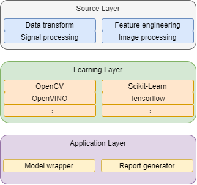
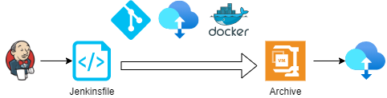

# 商業智慧服務架構 ( Business Intelligence Service Architecture )

本專案原稱為 Computer vision play，原本設計之初是想整合常見的電腦視覺演算法，並基於 Pipe & Filter 架構的概念撰寫一個專用於 C/C++ 或 Python 的軟體架構，並運用於嵌入式系統中或邊緣運算設備；然而，考量近年的產業變化與演算軟體演進，重新自系統層面審視對於影像處理、樣式識別、電腦視覺等基礎知識，皆回歸於特徵工程、機械學習、人工智慧等新一代詞彙。

對此，將專案重新定位為商業智慧服務架構 ( Business Intelligence Service Architecture )，並從系統運用層面規劃架構，考量其用途著眼於以下幾個要點：

+ 演算法的容器化編譯、執行、封裝，讓演算法運用如 [SaaS](https://zh.wikipedia.org/zh-tw/%E8%BD%AF%E4%BB%B6%E5%8D%B3%E6%9C%8D%E5%8A%A1) 或 [FaaS](https://en.wikipedia.org/wiki/Function_as_a_service)
+ 設計單元應包括
    - 主要語言，C/C++、Python
    - 服務單元，資料解析、演算法、資料彙整、報表產生
    - 演算框架，OpenCV、OpenVINO、Scikit-Learn、Tensorflow
    - 系統單元，Console pipeline executor、Jenkins、Elasticsearch-Logstash-Kibana

原始專案的設計目的，則回歸到[資料流架構](https://github.com/eastmoon/dataflow-architecture)設計，其運用的分野則需視對於演算法的計算量、效率而調整。

## 介紹 ( Introduction )

### 數據處理

實務設計如特徵處理、數據演算等程式後，不難發現其運作流程符合典型的 Pipe & Filter 架構，若說到這類演算處理架構，則可引用 Microsoft 的 DirectShow 運作架構來看。

	

> Reference : [DirectShow overview](https://www.slideserve.com/bijan/directshow-overview)

在 DirectShow 的架構中，其影像解碼的流程多如上圖所示，先透過 Source 進行訊號讀取並解析，在將統一格式的資料後交付給 Transform 解碼成對應的影像、聲音數據格式，最後交付給 Render 傳給對應設備進行繪製影像或釋放聲音。

考量實務碰過的數據處理狀況，最初設計時會僅以[資料流架構](https://github.com/eastmoon/dataflow-architecture)來考量，在單一語言與工具內完成整個運作流程即可，然而這樣的設計在應對現有的演算需求卻會顯得難以復用與維護。

### 架構設計

	

在研讀與實務諸多資料科學的文獻，不難發現對於應對問題的 **正確』**解答多半不存在，取而代之是會期望在諸多演算法中挑選最** 『適當』**的演算法，這就導致前述的數據處理方案，會因為多樣的來源有多樣的數據解析方案、也會因為挑選演算法需將相同解析交付多個演算法學習與驗證、並依據輸出需要彙整成報告或可執行的運用模型。

對此，將其系統架構規劃如上階層 ( Layer )

+ Source Layer
簡單的如日誌解析轉換、數據統計、訊號或影像處理，亦包括特徵工程處理如特徵篩選、數據降維等，以此處理程序將必要的數據提取並保存。

+ Model Layer
將 Source 完成的數據交付演算法框架，並選擇框架中可運行的演算法來進行學習、驗證、測試，最終產生模型資料、驗證與測試數據。

+ Application Layer
此層級目的是將前兩層的運作轉換成可執行程式或容器，例如將 Learning 產生的模型進行容器封裝以利後期運用，或依據驗證與測試數據產生報告。

整合上述運算階層，則可透過 DevOps 的工具進行整合，以達到如下的工作流程

	

在這流程中，其運作步驟如下：

+ Jenkins 觸發工作腳本
	- 自 Git 取得專案
	- 自 Storage 提取數據
	- 啟動 Docker 執行專案內容，獲得專案數據
+ Jenkins 收集專案數據並壓縮後儲存至 Storage
+ Jenkins 腳本會依據層級作為階段運作流程
+ Jenkins 腳本至少會處理一個層級的工作，至多所有層級皆處理

## 文獻

+ [雲端運算 IaaS、PaaS、SaaS 與 FaaS](https://cynthiachuang.github.io/Difference-between-IaaS-PaaS-SaaS-and-FaaS/)
+ Image processing
    - [Image processing wiki](https://zh.wikipedia.org/wiki/%E5%9B%BE%E5%83%8F%E5%A4%84%E7%90%86)
    - [IPOL Journal · Image Processing On Line](http://www.ipol.im/)
    - [Image processing online tutorials](http://www.imageprocessingplace.com/root_files_V3/tutorials.htm)
    - [Digital Image procesing](https://www.youtube.com/playlist?list=PLZ9qNFMHZ-A79y1StvUUqgyL-O0fZh2rs)
    - [Image Processing online demo](http://felixniklas.com/imageprocessing/)
    - [Basic Image Processing Demos](http://robotics.eecs.berkeley.edu/~sastry/ee20/)

+ Computer vision
    - [Machine learning coursera](https://www.youtube.com/watch?v=qeHZOdmJvFU&list=PLZ9qNFMHZ-A4rycgrgOYma6zxF4BZGGPW)
    - [What is an Image Processing Framework for Machine Learning?](https://www.iguazio.com/glossary/image-processing-framework/)

+ Machine learning
    - [Top 15 Machine Learning Frameworks for Machine Learning Experts](https://intellipaat.com/blog/machine-learning-frameworks/)
