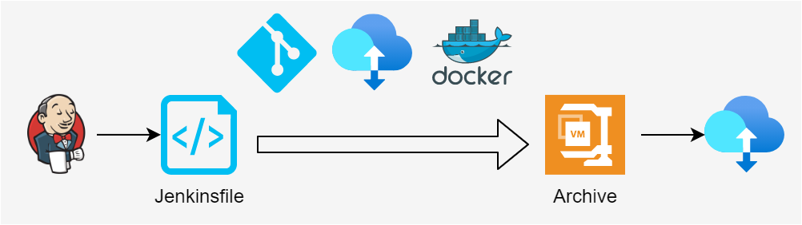

# 商業智慧服務架構 ( Business Intelligence Service Architecture )

本專案原稱為 Computer vision play，原本設計之初是想整合常見的電腦視覺演算法，並基於 Pipe & Filter 架構的概念撰寫一個專用於 C/C++ 或 Python 的軟體架構，並運用於嵌入式系統中或邊緣運算設備；然而，考量近年的產業變化與演算軟體發展，重新自系統層面審視對於影像處理、樣式識別、電腦視覺等基礎知識，皆回歸於特徵工程、機械學習、人工智慧等新一代詞彙。

對此，將專案重新定位為商業智慧服務架構 ( Business Intelligence Service Architecture )，並從開發維運的系統運用層面規劃架構，考量其用途著眼於以下幾個要點：

+ 演算法的容器化編譯、執行、封裝，讓演算法運用如 [SaaS](https://zh.wikipedia.org/zh-tw/%E8%BD%AF%E4%BB%B6%E5%8D%B3%E6%9C%8D%E5%8A%A1) 或 [FaaS](https://en.wikipedia.org/wiki/Function_as_a_service)
+ 系統單元應包括以下需求
    - 主要語言，C/C++、Python
    - 服務單元，資料彙整、資料解析、演算法執行、人工智慧模型建制與運用、數據呈現、報表產生
    - 演算框架，諸如 OpenCV、OpenVINO、Scikit-Learn、Tensorflow
    - 系統單元，基於 DevOps 的流程操作服務單元對應的開源軟體

原始專案的設計目的，則回歸到[資料流架構](https://github.com/eastmoon/dataflow-architecture)設計，其概念差異如下：

+ 資料流架構
    - 單一語言的軟體架構
    - 應用管線概念設計有序執行的軟體生命週期
    - 可運用於多執行緒與動態執行緒數量管理系統
+ 商業智慧服務架構
    - 多語言與軟體的整合系統架構
    - 基於 DevOps 運作週期規劃系統間軟體的整合
    - 應用管線概念設計有序執行的工作流 ( Workflow )
    - 運用於大量數據來源、大數據量資料彙整、運算、呈現

## 介紹 ( Introduction )

### 數據處理

實務設計如特徵處理、數據演算等程式後，不難發現其運作流程符合典型的 Pipe & Filter 架構，若說到這類演算處理架構，則可引用 Microsoft 的 DirectShow 運作架構來看。

	

> Reference : [DirectShow overview](https://www.slideserve.com/bijan/directshow-overview)

在 DirectShow 的架構中，其影像解碼的流程多如上圖所示，先透過 Source 進行訊號讀取並解析，在將統一格式的資料後交付給 Transform 解碼成對應的影像、聲音數據格式，最後交付給 Render 傳給對應設備進行繪製影像或釋放聲音。

然而實務數據處理狀況，若依據來源、規模，則需考量應基於資料流架構或基於商業智慧服務架構設計，在此基於大數據為基礎，考量以下數據狀況：

+ 數據來超過一個以上的發送源
+ 每秒產生至少一筆數據
+ 回朔資料會大批量傳送
+ 數據類型包括文數字、半結構數據集 ( JSON )、影像、聲音等

考量多樣數據類型且可以串流、批次匯入，若僅以單一軟體處理則會使軟體規模膨脹，因此應考慮分散給適當的軟體並採用分散式處理機制讓適當的軟體處理對應的數據。

### 架構設計

	

在研讀與實務諸多資料科學的文獻，不難發現對於應對問題的**『正確』解答多半不存在，取而代之是會期望在諸多演算法中挑選最『適當』**的演算法，這就導致前述的數據處理方案，會因為多樣的來源有多樣的數據解析方案、也會因為挑選演算法需將相同解析交付多個演算法學習與驗證、並依據輸出需要彙整成報告或可執行的運用模型。

對此，將其系統架構規劃如上圖階層 ( Layer )：

+ Source Layer
簡單的如日誌解析轉換、數據統計、訊號或影像處理，亦包括特徵工程處理如特徵篩選、數據降維等，以此處理程序將必要的數據提取並保存。

+ Model Layer
將 Source 完成的數據交付演算法框架，並選擇框架中可運行的演算法來進行學習、驗證、測試，最終產生模型資料、驗證與測試數據。

+ Application Layer
此層級目的是將前兩層的運作轉換成可執行程式或容器，例如將 Learning 產生的模型進行容器封裝以利後期運用，或依據驗證與測試數據產生報告。

若考量整合各運算階層，則可透過 DevOps 服務管理，並將各層所需的數據彙整至對應的資料庫，從而達到如下的系統架構

	

若以 Jenkins 為範例，則 DevOps 可設計如下流程。

	

在這流程中，其運作步驟如下：

+ Jenkins 觸發工作腳本
	- 自 Git 取得專案
	- 自 Storage 提取數據
	- 啟動 Docker 執行專案內容，獲得專案數據
+ Jenkins 收集專案數據並壓縮後儲存至 Storage
+ Jenkins 腳本會依據層級作為階段運作流程
+ Jenkins 腳本至少會處理一個層級的工作，至多所有層級皆處理

### 開源軟體

#### Source Layer

+ [Kettle](https://github.com/pentaho/pentaho-kettle)
+ [Kafka](https://zh.wikipedia.org/zh-tw/Kafka)
    - [Nifi](https://nifi.apache.org/)
    - [StreamSet](https://docs.streamsets.com/portal/platform-transformer/latest/transformer/GettingStarted/GettingStarted-Title.html#concept_a1b_zf4_pgb)
        + [Announcing StreamSets Data Collector 3.11.0 and StreamSets Data Collector Edge 3.11.0](https://streamsets.com/blog/announcing-streamsets-data-collector-3-11-0-and-streamsets-data-collector-edge-3-11-0/)
+ [HOP](https://hop.apache.org/)
+ [MinIO](https://min.io/)
    - [Apache Ozone](https://ozone.apache.org/)
        + [Breaking the HDFS Speed Barrier - a First for Object Storage](https://blog.min.io/hdfsbenchmark/)
        + [How is Apache Minio different than Apache Hadoop?](https://www.quora.com/How-is-Apache-Minio-different-than-Apache-Hadoop)
        + [Hadoop vs Minio - stackshare](https://stackshare.io/stackups/hadoop-vs-minio)
    - [Upload Files Using Pre-signed URLs](https://min.io/docs/minio/linux/integrations/presigned-put-upload-via-browser.html)
    - [Posting a File with Curl](https://reqbin.com/req/c-dot4w5a2/curl-post-file)
+ [Ceph](https://docs.ceph.com/en/quincy/)

#### Model Layer

+ NumPy
+ PyTorch
+ OpenCV
+ OpenVINO
+ Scikit-Learn
+ Tensorflow

#### Application

+ [Grafana](https://grafana.com/)
+ [Http File Server](https://github.com/eastmoon/infra-hfs)

#### DevOps

+ [Gitlab](https://github.com/eastmoon/infra-gitlab)
+ [Flink](https://zh.wikipedia.org/zh-tw/Apache_Flink)
+ [Airflow](https://github.com/eastmoon/infra-airflow)
+ [Jenkins](https://github.com/eastmoon/infra-jenkins)

#### Database

+ OLTP
	- [PostgreSQL](https://zh.wikipedia.org/zh-tw/PostgreSQL)
+ OLAP
  - [Greenplum](https://greenplum.org/)
	- [Cassandra](https://zh.wikipedia.org/zh-tw/Cassandra)
+ Converged database
	- [MySQL](https://www.mysql.com/)
	- [Oracle](https://zh.wikipedia.org/wiki/%E7%94%B2%E9%AA%A8%E6%96%87%E5%85%AC%E5%8F%B8)
	- [MariaDB](https://zh.wikipedia.org/zh-tw/MariaDB)
+ Cache ( Semi-structured data )
	- [MongoDB](https://zh.wikipedia.org/zh-tw/MongoDB)
	- [Elasticsearch](https://github.com/eastmoon/infra-elk)

## 文獻

+ [雲端運算 IaaS、PaaS、SaaS 與 FaaS](https://cynthiachuang.github.io/Difference-between-IaaS-PaaS-SaaS-and-FaaS/)
+ Image processing
    - [Image processing wiki](https://zh.wikipedia.org/wiki/%E5%9B%BE%E5%83%8F%E5%A4%84%E7%90%86)
    - [IPOL Journal · Image Processing On Line](http://www.ipol.im/)
    - [Image processing online tutorials](http://www.imageprocessingplace.com/root_files_V3/tutorials.htm)
    - [Digital Image procesing](https://www.youtube.com/playlist?list=PLZ9qNFMHZ-A79y1StvUUqgyL-O0fZh2rs)
    - [Image Processing online demo](http://felixniklas.com/imageprocessing/)
    - [Basic Image Processing Demos](http://robotics.eecs.berkeley.edu/~sastry/ee20/)

+ Computer vision
    - [Machine learning coursera](https://www.youtube.com/watch?v=qeHZOdmJvFU&list=PLZ9qNFMHZ-A4rycgrgOYma6zxF4BZGGPW)
    - [What is an Image Processing Framework for Machine Learning?](https://www.iguazio.com/glossary/image-processing-framework/)

+ Machine learning
    - [Top 15 Machine Learning Frameworks for Machine Learning Experts](https://intellipaat.com/blog/machine-learning-frameworks/)

+ ETL
    - [Day29 NiFi 與其他工具的比較](https://ithelp.ithome.com.tw/articles/10281489)

+ Object Storage
    - [4 Open Source Object Storage Platforms for 2023](https://betterprogramming.pub/4-open-source-object-storage-platforms-for-2021-ceeaceb7e273)
    - [架構師都知道的分布式對象存儲解決方案](https://kknews.cc/zh-tw/code/vrlljky.html)

+ Database
    - [什麼是 OLTP？什麼是 OLAP？](https://datadrivenai.wordpress.com/2019/11/01/%E4%BB%80%E9%BA%BC%E6%98%AF-oltp%EF%BC%9F%E4%BB%80%E9%BA%BC%E6%98%AF-olap%EF%BC%9F/)
    - [OLTP vs OLAP: Comparison between OLAP and OLTP](https://mindmajix.com/oltp-vs-olap)
    - [Top 10 Databases to Use in 2021](https://towardsdatascience.com/top-10-databases-to-use-in-2021-d7e6a85402ba)
    - [Greenplum 和 PostgreSQL 的關係為何？](https://www.omniwaresoft.com.tw/product-news/greenplum-news/differences-between-greenplum-and-postgresql/)
