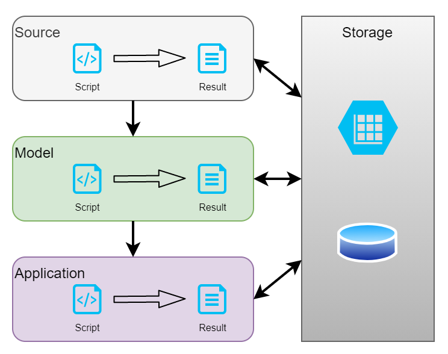

# 商業智慧服務架構 ( Business Intelligence Service Architecture )

本專案原稱為 Computer vision play，原本設計之初是想整合常見的電腦視覺演算法，並基於 Pipe & Filter 架構的概念撰寫一個專用於 C/C++ 或 Python 的軟體架構，並運用於嵌入式系統中或邊緣運算設備；然而，近年的產業變化與演算軟體發展，重新自系統層面審視對於影像處理、樣式識別、電腦視覺等基礎知識，皆回歸於特徵工程、機械學習、人工智慧等新一代詞彙，進而推展到大數據處理、商業智慧等軟體框架。

對此，將專案重新定位為商業智慧服務架構 ( Business Intelligence Service Architecture )，並從開發維運來規劃架構，考量其用途著眼於以下幾個要點：

+ 基於 [SaaS](https://zh.wikipedia.org/zh-tw/%E8%BD%AF%E4%BB%B6%E5%8D%B3%E6%9C%8D%E5%8A%A1) 或 [FaaS](https://en.wikipedia.org/wiki/Function_as_a_service) 設計架構
+ 系統單元包括如下
    - 服務單元，資料彙整、資料解析、演算法執行、人工智慧模型建制與運用、數據呈現、報表產生
    - 演算軟體，諸如 OpenCV、OpenVINO、Scikit-Learn、Tensorflow
    - 系統框架，基於管線 ( Pipeline ) 或工作流 ( Workflow ) 設計的流程操作開源軟體

原始專案的設計目的，則回歸到[資料流架構](https://github.com/eastmoon/dataflow-architecture)設計，其概念差異如下：

+ 資料流架構
    - 單一語言的軟體架構
    - 應用管線概念設計有序執行的軟體生命週期
    - 可運用於多執行緒與動態執行緒數量管理系統
+ 商業智慧服務架構
    - 多語言與軟體的整合系統架構
    - 基於 DevOps 運作週期規劃系統間軟體的整合
    - 基於管線 ( Pipeline ) 或工作流 ( Workflow ) 概念設計處裡流程
    - 可處理批次或串流數據來源
    - 可處理多工且併發的資料彙整、運算處理流程
    - 可提供數據視覺化的呈現

## 架構設計

商業智慧服務架構設計，是基於以下調查與研究所得的概念與框架定義，經整合並考量使用需求來規劃。

+ [數據處理觀念](./doc/data-processing-concept-a-survey.md)
+ [數據處理軟體](./doc/data-processing-software-a-survey.md)

### 數據處理

傳統的數據處理實務如特徵處理、數據演算等程式，不難發現其運作流程符合典型的 Pipe & Filter 架構，若說到這類演算處理架構，則可引用 Microsoft 的 DirectShow 運作框架來看。

	

> Reference : [DirectShow overview](https://www.slideserve.com/bijan/directshow-overview)

在 DirectShow 的框架中，其影像解碼的流程多如上圖所示，先透過 Source 進行訊號讀取並解析，在將統一格式的資料後交付給 Transform 解碼成對應的影像、聲音數據格式，最後交付給 Render 傳給對應設備進行繪製影像或釋放聲音。

	

> Reference : [What Is a Data Pipeline?](https://hazelcast.com/glossary/data-pipeline/)

若將其抽象化為數據管線，則如上圖所示，資料從一端輸入並經過數個步驟後匯出，其不同於 DirectShow 框架在數據處理還需考量數據來源、規模等如下假設狀況：

+ 數據來超過一個以上的發送源
+ 每秒產生至少一筆數據
+ 回朔資料會大批量傳送
+ 數據資料會不定時即時上傳
+ 數據類型包括文數字、半結構數據集 ( JSON )、影像、聲音等
+ 數據處理即時性需求低於分、秒

考量上述多樣數據類型且包括串流、批次匯入，若僅以單一軟體處理則會使軟體規模膨脹或技術難以統整，因此，本架構設計基於分散功能於適當的軟體並採用分散式處理機制，讓適當的軟體處理對應的數據。

### 架構設計

	

在研讀與實務諸多資料科學文獻，調研現今百家爭鳴的諸多開源、商業軟體，對於要應對的議題 **『正確』解答多半不存在，取而代之是會期望在諸多方案中挑選最『適當』** 的整合方案，這也是前述數據處理方案與本專案重構的起因。

對此，將其系統架構規劃如上圖階層 ( Layer )：

+ Source Layer
簡單的如日誌解析轉換、數據統計、訊號或影像處理，亦包括特徵工程處理如特徵篩選、數據降維等，以此處理程序將必要的數據提取並保存。

+ Model Layer
將 Source 完成的數據交付演算法框架，並選擇框架中可運行的演算法來進行學習、驗證、測試，最終產生模型資料、驗證與測試數據。

+ Application Layer
此層級目的是將前兩層的運作轉換成可執行程式或容器，例如將 Learning 產生的模型進行容器封裝以利後期運用，或依據驗證與測試數據產生報告。

若考量整合各運算階層，則可透過 Framework 服務管理整理，並將各層所需的數據彙整至對應的 Storage，從而達到如下的系統架構

	

若詳細描述框架 ( Framework ) 的工作流 ( Workflow )，則其預想基礎流程如下圖。

	

+ 框架 ( Framework ) 建置或管理著工作流
+ 框架 ( Framework ) 的工作流基於一個腳本 ( Script ) 運作
+ 腳本 ( Script ) 自倉儲 ( Storage ) 取得數據
+ 腳本 ( Script ) 基於其內容運作
	- 自 Git 取得專案
	- 自 Cloud 提取額外資訊
	- 啟動 Docker 執行服務並獲得運行結果 ( Result )
+ 結果 ( Result ) 依據所需格式儲存倉儲 ( Storage )

對於框架 ( Framework ) 來說，工作流適用於各層 ( Layer )，因此若方到各層中，則依據分層架構 ( Layered Architecture ) 其管線 ( Pipeline )如下圖。

	

+ 框架 ( Framework ) 建置或管理著管線
+ 各層內的工作流可為框架 ( Framework ) 管理或各層所屬的軟體管理
+ 各層間的數據皆存儲於倉儲 ( Storage )
+ 管線是依據從數據源  ( Source ) 到數據模型 ( Model ) 到數據應用 ( Application )
    - 管線不可跨越層，但層可能無需執行任何行為
    - 管線是單向運作，不可反向回退

### 開源軟體
